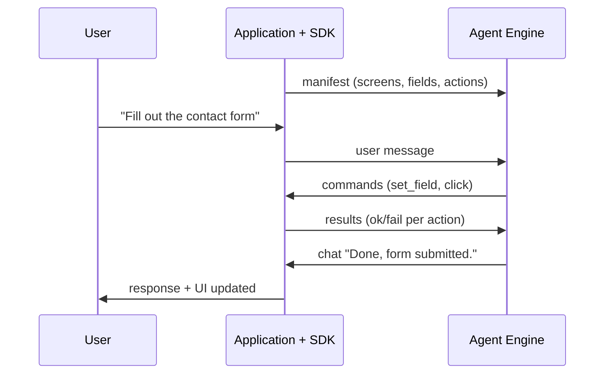

# ACP -- Agent Control Protocol

**ACP lets AI agents control any existing application through a structured protocol -- no vision models, no DOM scraping, no guessing.**

[](LICENSE)
[](spec/acp-v2.json)
[](spec/SPEC.md)
[](https://github.com/agent-control-protocol/acp-server)

<p align="center">
  <a href="https://www.youtube.com/watch?v=6nWLXdYwKUs">
    
  </a>
  <br>
  <sub>Click to watch: AI agent controlling a live application through ACP</sub>
</p>

**[Live Demo](https://primoia.ai/sandbox)** | **[Specification](spec/SPEC.md)** | **[Reference Server](https://github.com/agent-control-protocol/acp-server)** | **[Discussions](https://github.com/agent-control-protocol/acp/discussions)**

---

## The Problem

AI agents can access data (MCP), talk to other agents (A2A), stream events to frontends (AG-UI), and generate new UI (A2UI). But none of them allow an agent to **operate an existing application's interface** -- the screens, forms, and actions your users already work with.

## How ACP Solves It

The application declares its UI structure through a manifest. The agent sends structured commands -- `set_field`, `click`, `navigate` -- and the SDK executes them against the live interface.



## How ACP Compares

| | ACP | MCP | A2A | AG-UI | RPA |
|---|---|---|---|---|---|
| **Purpose** | Agent controls existing UI | Agent accesses data/tools | Agent-to-agent coordination | Agent streams to frontend | Batch UI automation |
| **Operates existing UI?** | Yes | No | No | No (frontend must implement handlers) | Yes (via vision/DOM) |
| **Requires vision/DOM?** | No (structured manifest) | N/A | N/A | N/A | Yes |
| **Real-time conversational?** | Yes | Yes | Yes | Yes | No |
| **Multi-platform?** | Web, mobile, desktop | API-dependent | API-dependent | Web only | Platform-specific |
| **Token cost** | Low (structured data) | Low | Low | Low | High (screenshots) |
| **Fragile to UI changes?** | No (manifest-driven) | N/A | N/A | N/A | Yes |

ACP is complementary to these protocols, not a replacement. Use MCP for data access, A2A for agent coordination, and ACP when the agent needs to operate application interfaces.

## Getting Started

### 1. Run the demo

**No setup required:** Try the [live sandbox](https://primoia.ai/sandbox).

**Or run locally:**

```bash
git clone https://github.com/agent-control-protocol/acp-demo.git
cd acp-demo && npm install
cp .env.example .env   # add your OpenAI API key
npm start              # open http://localhost:3098
```

Type *"Register my dog Max, owner Sarah Connor, sarah@skynet.com"* and watch the agent fill the form.

### 2. Integrate ACP into your application

**Application side (SDK)** -- Describe your UI as an ACP manifest:

```json
{
  "type": "manifest",
  "app": "my-app",
  "currentScreen": "contact",
  "screens": {
    "contact": {
      "id": "contact",
      "label": "Contact Form",
      "fields": [
        { "id": "name", "type": "text", "label": "Full Name", "required": true },
        { "id": "email", "type": "email", "label": "Email", "required": true },
        { "id": "message", "type": "textarea", "label": "Message" }
      ],
      "actions": [
        { "id": "submit", "label": "Send Message" }
      ]
    }
  }
}
```

Connect to an ACP-compliant engine via WebSocket, send the manifest, and handle incoming commands (`set_field`, `click`, etc.) against your UI. See the [demo source](https://github.com/agent-control-protocol/acp-demo) for a full working example.

**Agent side (Engine)** -- Use the reference server:

```bash
npm install @acprotocol/server
```

```typescript
import { createACPServer } from "@acprotocol/server";

const server = createACPServer({
  port: 3099,
  openaiApiKey: process.env.OPENAI_API_KEY,
});

server.start();
```

The engine receives manifests, interprets user messages using the UI structure as context, and sends back commands. See the [reference server docs](https://github.com/agent-control-protocol/acp-server) for configuration options.

### 3. Understand the message flow

The user sends natural language. The agent reads the manifest, understands the UI, and responds with commands:

```json
// Agent sends commands
{
  "type": "command",
  "seq": 1,
  "actions": [
    { "do": "set_field", "field": "name", "value": "Alice Park" },
    { "do": "set_field", "field": "email", "value": "alice@example.com" },
    { "do": "set_field", "field": "message", "value": "I need help resetting my account." },
    { "do": "click", "action": "submit" }
  ]
}

// SDK reports results
{
  "type": "result",
  "seq": 1,
  "results": [
    { "index": 0, "success": true },
    { "index": 1, "success": true },
    { "index": 2, "success": true },
    { "index": 3, "success": true }
  ]
}
```

## What ACP Defines

- **8 UI Actions**: `navigate`, `set_field`, `clear`, `click`, `show_toast`, `ask_confirm`, `open_modal`, `close_modal`

- **15 Field Types**: `text`, `number`, `currency`, `date`, `datetime`, `email`, `phone`, `masked`, `select`, `autocomplete`, `checkbox`, `radio`, `textarea`, `file`, `hidden`

- **Manifest Structure**: screens, fields, actions, modals -- everything the agent needs to understand the application's UI and current state

- **Command-Result Loop**: the agent sends commands with sequence IDs; the SDK reports success or failure per action, enabling reliable multi-step workflows

- **Streaming**: token-by-token chat responses for real-time UX alongside command execution

## Why Not Vision/Scraping?

- **Vision-based approaches** (screenshot analysis, pixel coordinates) are slow, expensive in tokens, and fragile across resolutions and themes. A single UI redesign breaks everything.

- **DOM scraping** couples the agent to implementation details that change on every deploy. It does not work on native mobile or desktop applications at all.

- **RPA tools** are heavyweight, enterprise-only, and designed for batch automation -- not real-time conversational interaction.

- **ACP**: the application declares its own structure. The agent operates with certainty, not heuristics. Works on any platform -- web, mobile, desktop -- because the SDK mediates between the protocol and the native UI layer.

## Protocol, Not Product

ACP is a protocol specification, not a product. Anyone can implement an ACP-compliant engine (the agent side) or SDK (the application side). The protocol defines the contract between them.

The first production implementation is [Vocall Engine](https://primoia.ai) by Primoia, which powers ACP alongside voice interaction.

## Specification

| Document | Description |
|----------|-------------|
| [`spec/acp-v2.json`](spec/acp-v2.json) | JSON Schema for all ACP message types |
| [`spec/SPEC.md`](spec/SPEC.md) | Formal specification (message lifecycle, error handling, sequencing) |
| [`examples/`](examples/) | Annotated example message exchanges |
| [`conformance/`](conformance/) | Conformance test suite for validating implementations |

## Implementations

| Implementation | Type | Platform | Status |
|---|---|---|---|
| [Vocall Engine](https://primoia.ai) by Primoia | Server | Go | Production |
| [vocall_sdk](https://pub.dev/packages/vocall_sdk) by Primoia | SDK | Flutter | Production |
| [vocall-react](https://primoia.ai) by Primoia | SDK | React / Next.js | Production |
| [`@acprotocol/server`](https://github.com/agent-control-protocol/acp-server) | Server (Reference) | TypeScript | Beta |
| [acp-demo](https://github.com/agent-control-protocol/acp-demo) | Interactive Demo | TypeScript | Beta |

Building an ACP implementation? Open a PR to add it to this table.

## Extensions

The core protocol handles text interaction and UI control. Implementations MAY extend the protocol to support additional modalities such as voice interaction, haptic feedback, or accessibility features. Extensions should be namespaced to avoid conflicts with future protocol versions.

## Community

- [GitHub Discussions](https://github.com/agent-control-protocol/acp/discussions) — Questions, ideas, and general discussion
- [Issue Tracker](https://github.com/agent-control-protocol/acp/issues) — Bug reports and feature requests
- [Code of Conduct](CODE_OF_CONDUCT.md)
- [Security Policy](SECURITY.md)

## Contributing

See [CONTRIBUTING.md](CONTRIBUTING.md) for guidelines on proposing changes, reporting issues, and submitting implementations.

## License

Apache 2.0 -- see [LICENSE](LICENSE) for details.
